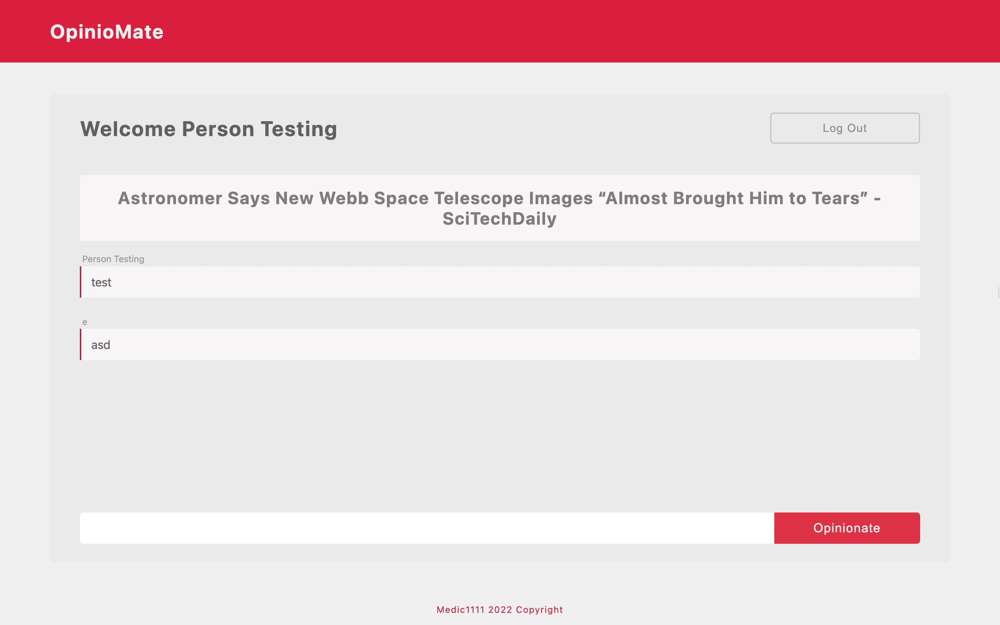

# PROJECT

[Live link](https://opiniomate.herokuapp.com/)

Backend project that allows a registered user to make a single comment on a daily news heading updated every 24 hours

## THE IDEA:

- Create a Opinion platform
- Random topic generated daily
- User will be able to type a single opinion on the topic
- That will be rewritten once a new topic appears
- The name will be available dynamically
- All opinions will be rendered in the opinion page
- Root will require registration and login
- MongoDB-Atlas for Database
- Express Session for cookies and session
- Passport for Encryption, hash, salting, authentications
- Only those authenticated will see posts page

---

## TECH:

1. NodeJS
2. Express
3. EJS
4. PASSPORT
5. THIRD-PARTY-NEWS-API
6. EXPRESS-SESSION
7. MONGODB

## START

1. Download project and open it on your favorite IDE

2. On the terminal, run: `npm install`

3. Once dependencies are downloaded, run the command: `node index.js`

4. Alternatively, if nodemon is installed, run: `nodemon index.js`

### TESTING CREDENTIALS:

- Username: test@test.com
- Password: test

### PLAN OF ACTION:

### STEP ONE: ROOT(HOME)

- At root, a welcome, log in button, and register button will be display.
- Register button will redirect to Register Route
- Log in button will redirect to Login Route

### REGISTER

- If successful, redirect to Posts
- Else, Redirect to Register

### LOG IN

- If Successfull, redirect to Posts
- Else, redirect to Log In

### SESSION OVER (Closing Browsing Session or LOGOUT)

- If Session Over Redirect to Log In
- If LOGOUT Redirect to ROOT (Home)
